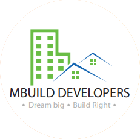

# 🏗️ MBUILD DEVELOPERS — Official Website

<p align="center">
  <b>Dream Big, Build Right</b><br>
  Architecture • Engineering • Contracting
</p>

<p align="center">
  
</p>

<p align="center">
  
  
  
  
  
</p>

---

## 📌 Project Overview

| Detail | Info |
|--------|------|
| **Company** | MBUILD Developers |
| **Proprietor** | Er. Pramod Balasaheb Jadhav (B.E. Civil) |
| **Established** | 2016 |
| **GST** | 27BAIPJ8787J1ZW |
| **Phone** | +91 86009 28493 / +91 86691 56263 |
| **Email** | mbuiltsangli@gmail.com / mbuilddevelopers@gmail.com |
| **Address** | Main Road, Behind AK Mobiles, Kundal, Tal. Palus, Sangli – 416309, Maharashtra |
| **Instagram** | [@mbuilddevelopers2024](https://www.instagram.com/mbuilddevelopers2024) |

---

## 📁 File Structure

```bash
mbuild-developers-website/
│
├── index.html
│
├── assets/
│   ├── css/
│   ├── js/
│   ├── images/
│   └── videos/
│
└── pages/
    ├── About-Us.html
    ├── Contact-Us.html
    ├── Civil-Projects.html
    ├── Civil-Project-Detail.html
    ├── Interior-projects.html
    ├── Photo-Gallary.html
    └── Our-product-Services.html
```

---

## 📄 Pages — What's Inside Each

### `index.html` — Homepage
- Full-screen cinematic hero with Ken Burns zoom animation on `project_14.jpeg`
- Gold scroll progress bar at top
- Trust stats bar (250+ Projects / 9+ Years / 200+ Clients / 12+ Districts)
- Services section (6 service cards with hover effects)
- Why Us — asymmetric split layout with real project photo
- Gallery preview with filter tabs (All / Residential / Interior / Industrial / Other)
- Civil Projects preview — 3 featured projects linking to detail pages
- Interior Projects preview — 3 interior cards
- Testimonials — 3 client reviews on dark blue background
- Certificates strip — PWD Class V, GST, B.E. Civil, MSME, ISO
- CTA banner — dark navy with dot pattern + radial gold glow
- WhatsApp floating button with pulse animation

---

### `pages/Our-product-Services.html` — Services
- Cinematic hero with services photo
- Alternating service blocks (text left / image right, then reversed):
  1. Residential Construction
  2. Interior Design
  3. Architectural Planning
  4. Renovations & Remodelling
  5. Project Management
- Each block has: icon, category tag, description, checklist, discuss link
- **Gold offset drop shadow** on all service images (`box-shadow: 14px 14px 0px #c9a84c`)
- Feature stats bar
- CTA section

---

### `pages/Civil-Projects.html` — Civil Projects Listing
- Cinematic hero (420px height)
- Filter pills: All / Residential / Institutional / Commercial / Other
- **Masonry editorial grid** (12-column, asymmetric layout)
- 10 real project cards from company PDF:
  1. Asha World School (₹3.30 Cr, 15,000 Sq.Ft.)
  2. Residential Building — Kiran Gavde (₹1.05 Cr)
  3. Green Building — Dr. Vaibhav Hendre (₹72 L)
  4. Residential Bunglow — Sampat Gavde (₹2.56 Cr)
  5. Residential Building — Suhas Sankpal (₹1.09 Cr)
  6. Viraj Water Park (₹1.50 Cr, 16,000 Sq.Ft.) — panoramic
  7. Hotel Building — Dhanaji Jadhav (₹88 L)
  8. Public Building — Grampanchayat Nagrale (₹1.20 Cr)
  9. Residential Building — Rajendra Lad (₹1.12 Cr)
  10. Kumbheshwar Mahadev Mandir (₹1.55 Cr)
- 3D card tilt on mousemove + dim-on-hover effect
- Scroll reveal animations
- Grid / List view toggle
- Each card → "View Project →" links to `Civil-Project-Detail.html?id=project-id`

---

### `pages/Civil-Project-Detail.html` — Project Detail Page
- **Single template file** that powers all 10 project pages via URL parameter
- Usage: `Civil-Project-Detail.html?id=asha-school`
- Dynamic content: title, location, area, cost, client, consultant, structure type
- Full project description + feature tags grid
- Photo gallery with lightbox (← → keyboard + ESC navigation)
- Related Projects section (3 cards)
- Sidebar: Investment cost, company credentials, WhatsApp enquiry button

**Project ID Reference:**
| ID | Project |
|----|---------|
| `asha-school` | Asha World School |
| `kiran-gavde` | Residential — Kiran Gavde |
| `green-building` | Green Building — Dr. Vaibhav Hendre |
| `sampat-gavde` | Residential Bunglow — Sampat Gavde |
| `suhas-sankpal` | Residential — Suhas Sankpal |
| `hotel-dhanashree` | Hotel Building — Dhanaji Jadhav |
| `viraj-waterpark` | Viraj Water Park |
| `nagrale-gp` | Public Building — Nagrale |
| `rajendra-lad` | Residential — Rajendra Lad |
| `mahadev-mandir` | Kumbheshwar Mahadev Mandir |

---

### `pages/Interior-projects.html` — Interior Projects
- Cinematic hero with bedroom photo as background
- Filter pills: All Work / Bedroom / Clinic / Living Room / Dining
- Magazine masonry grid (6 real interior project cards)
- 3D tilt + scroll reveal + dim-on-hover
- Full-screen lightbox (reads `src` from DOM, keyboard navigation)
- Grid/List view toggle
- CTA section

---

### `pages/Photo-Gallary.html` — Photo Gallery
- Hero with video background (`hero-video.mp4`) + image fallback
- Filter pills: All Work / Residential / Interior / Industrial / Other
- **CSS Masonry grid** (4 columns → responsive) — images at natural height
- 40 real photos from all project categories
- Hover overlay with category, title, location
- Full-screen lightbox with counter — filter-aware (lightbox only shows visible photos)
- Scroll reveal animations
- CTA + footer

---

### `pages/Contact-Us.html` — Contact Page
- Cinematic hero with interior photo
- 3 Quick Info Cards (Phone / Email / Address) on blue bar
- Two-column layout:
  - **Left**: Contact details, social buttons (WhatsApp / Instagram / Facebook), Business Hours card with live "Open Now" badge
  - **Right**: Project Enquiry form with fields: Name, Phone, Email, Project Type (dropdown), Location, Message
- **EmailJS integration** — form sends real email to `mbuiltsangli@gmail.com`
- Button states: Normal → Loading (spinner) → Success (green) → Error (red)
- Google Maps embed (coordinates: 17.117387844078543, 74.41011076351721)
- Get Directions + Ask on WhatsApp map buttons
- CTA + footer

---

### `pages/About-Us.html` — About Us Page
- Cinematic hero
- Stats bar (250+ Projects / 9+ Years / 200+ Clients / ₹15Cr+)
- **Our Story** — Company history, mission, highlights (Est. 2016, PWD V, ₹1.31Cr turnover)
- **Founder Section** — Er. Pramod B. Jadhav profile card with credentials, personal quote block, bio, skill tags
- **Meet the Team** — 4 engineer cards (Er. Pramod Jadhav, Er. Shankar V. Patil, Er. Rohit A. Koli, Er. Viraj V. Patil)
- **Vision & Mission** — 4 cards on dark blue background
- **Award & Achievement Gallery** — 6-photo mosaic grid with lightbox
- **Words from Renowned People** — 5 testimonials from real consultants and clients (Ar. Ranjit Mulay, Mr. Sampat Gavde, Grampanchayat Nagrale, Ar. Vishwajeet Patil, Kumbheshwar Trust)
- **Awards & Achievements** — 6 real milestone cards
- **Certifications** — PWD Class V, GST, B.E. Civil, MSME, ISO 9001
- CTA + footer

---

## 🎨 Design System

### Colors
| Variable | Value | Usage |
|----------|-------|-------|
| `--gold` | `#c9a84c` | Primary accent, buttons, icons |
| `--gold-light` | `#e2c97e` | Button hover, highlights |
| `--blue` | `#1a3558` | Primary dark color, headings |
| `--blue2` | `#254a78` | Secondary blue |
| `--navy` | `#0d1f35` | CTA banner background |
| `--bg` | `#d8eaf0` | Page background (light blue) |
| `--beige` | `#f5f0e8` | Section alternate background |

### Typography
| Font | Usage |
|------|-------|
| **Playfair Display** | All headings, section titles |
| **DM Sans** | Body text, labels, buttons |
| **Cormorant Garamond** | Italic accent text in hero/CTA |
| **Great Vibes** | Founder signature |
| **Alfa Slab One** | Main site logo (MBUILD DEVELOPERS) |
| **Lucida Calligraphy** | Tagline ("Architecture, Engineer & Contractors") |

### Global Components (from `style.css`)
- `.main-header` — beige header with logo + navbar
- `.navbar` — dark blue gradient, gold bottom border, uppercase links with underline animation
- `.footer` — dark navy 4-column grid with social icons
- `.cta-banner` — dark navy + dot pattern + radial gold glow
- `.cta-btn-primary` — gold filled button
- `.cta-btn-secondary` — dark green WhatsApp button
- `.page-hero` — universal inner page hero (66vh, bg image, dark overlay)
- `.service-block` — alternating service layout with gold shadow on images
- `.gallery-card` — photo grid card with hover overlay

---

## ⚙️ EmailJS Setup (Contact Form)

The contact form on `Contact-Us.html` uses **EmailJS** to send enquiries directly to `mbuiltsangli@gmail.com` without any backend server.

### Setup Steps:
1. Go to [emailjs.com](https://www.emailjs.com) → Sign up free
2. **Email Services** → Add Service → Gmail → connect `mbuiltsangli@gmail.com` → copy **Service ID**
3. **Email Templates** → Create Template → use these variables:

```
Subject: New Enquiry from {{from_name}} — mBuild Website

Name:         {{from_name}}
Phone:        {{phone}}
Email:        {{from_email}}
Project Type: {{project_type}}
Location:     {{location}}

Message:
{{message}}
```

4. Copy **Template ID** and **Public Key** (Account → API Keys)
5. Open `Contact-Us.html` and replace:

```js
const EMAILJS_PUBLIC_KEY  = 'YOUR_PUBLIC_KEY';
const EMAILJS_SERVICE_ID  = 'YOUR_SERVICE_ID';
const EMAILJS_TEMPLATE_ID = 'YOUR_TEMPLATE_ID';
```

**Free tier**: 200 emails/month — sufficient for most enquiries.


## 🏢 Company Data Reference

### Technical Team
| Name | Role | Qualification |
|------|------|---------------|
| Er. Pramod B. Jadhav | Proprietor / Founder | B.E. Civil — Shivaji University (First Class) |
| Er. Shankar V. Patil | Sr. Engineer, Project Manager | B.E. Civil |
| Er. Rohit A. Koli | Jr. Engineer | B.E. Civil |
| Er. Viraj V. Patil | Jr. Engineer | B.E. Civil |

---

*Built with pure HTML, CSS & JavaScript — no frameworks, no build tools required.*
*© 2026 MBUILD DEVELOPERS. All Rights Reserved.*
